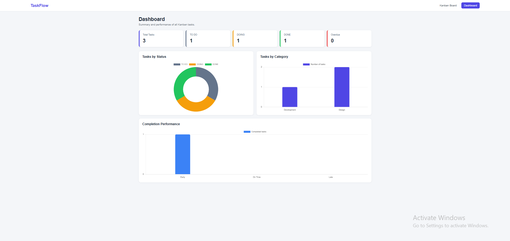

# TaskFlow – Kanban Board with Dashboard

TaskFlow is a React web application that helps users create, organize, and monitor tasks. Tasks are arranged in three columns: TO DO, DOING, and DONE. The Dashboard summarizes task information using cards and charts.

## Live Website

https://nagr1.github.io/kanban-board/

## Project Features

- Create new tasks
- Edit existing tasks
- Delete tasks with a confirmation message
- Move tasks between TO DO, DOING, and DONE
- Assign a responsible person to each task
- Select an existing category
- Add new categories
- Set start dates and due dates
- Automatically record the completion date
- Identify overdue tasks
- Display task summary cards
- Display tasks by status in a doughnut chart
- Display tasks by category in a bar chart
- Compare early, on-time, and late task completion
- Save tasks and categories in Local Storage

## Screenshots

### Kanban Board


### Dashboard



## Group Members

- Nyein Chan Htet Naing
- Myat Phone Pyae
- Lin Myat Thu

## Basic Usage Instructions

1. Open the live website.
2. Click **Add Task** to create a new task.
3. Enter the task title, description, category, dates, responsible person, and status.
4. Click **Create Task** to add the task to the Kanban Board.
5. Use the **Move to** menu to move a task between TO DO, DOING, and DONE.
6. Click **Edit** to update a task.
7. Click **Delete** to remove a task.
8. Open the **Dashboard** page to view task totals and charts.
9. Refresh the page to confirm that the data remains saved in Local Storage.

## Technologies Used

- React
- Vite
- React Router
- Chart.js
- React Chart.js 2
- CSS
- Local Storage

## Run the Project Locally

Install the required packages:

```bash
npm install